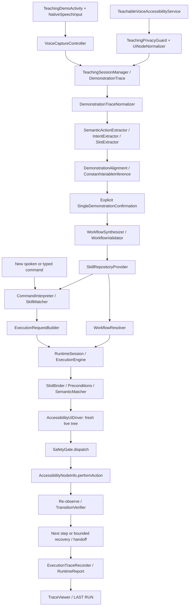

# Actual production architecture

Every arrow above is a production call, not a fixture bridge. Command interpretation does not execute Android actions; runtime does not synthesize workflows. `ExecutionRequest` contains an ID and bindings, not a Workflow. The Activity resolves learning and matching against `SkillRepositoryProvider`; process-scoped `RuntimeSession` injects the same repository into one engine. In-memory content is lost on process death.

The save screen analyzes **one actual trace**, asks which observed slots are variable, then synthesizes and validates. Multi-example inference remains available unchanged. Consecutive text edits of the same identified field become one final semantic input action. Captured state transitions use consistent workflow labels; runtime associates those labels with verified semantic fingerprints, never demonstration UUIDs.

Runtime admission validates request/workflow/slots and unsupported verification. Every step observes, checks safety and preconditions, scores a unique target, then asks the Android adapter to reacquire the tree and repeat checks. Only the driver owns live nodes. Every acquired node is released in `finally`; no node crosses into serializable contracts. Action support/enabled/visibility checks are live. `ACTION_SET_TEXT`, click, long-click and directional accessibility scroll are the supported effects.

The driver’s one `performAction` site is inside synchronized `SafetyGate.dispatch`. Handoff and cancellation latch it. No retry or later request can bypass that gate. The app’s reset is explicit and cannot reset an active engine. Activity recreation preserves the engine/latch/report. Service disconnection causes failure/handoff.

Verification polls boundedly, ignores UUID/time/bounds and checks semantic change plus declared evidence. Text entry additionally checks the observed field value. Attempted effects are never automatically repeated. Recovery only retries pre-dispatch matching; popup/back strategies hand off because the contract cannot identify a safe dismissal action.

`ExecutionTrace` supports action/state events, not decisions. `RuntimeReport` carries local decisions and stopped-step metadata without changing contracts. Runtime traces redact all UI text; UI displays truthful outcome, including attempted-but-unverified actions.

## Gap map

- IMPLEMENTED / CONNECTED: capture, synthesis, persistent disk-backed repository, request builder, engine, fresh nodes, safety, verification, reporting, push-to-talk, automatic runtime discovery.
- TESTED: JVM tests cover persistence across restarts, matching, binding, state labels, multi-step execution, lock persistence, unknown/missing/ambiguous cases, and redaction; see EVALUATION for device evidence.
- LIVE-DEPENDENT: recognizer/provider, third-party app accessibility quality, keyboard/window behavior, target screen setup.
- LIMITED: finite command grammar, single-app capture, manual variable confirmation, no historical-version resolution or autonomous popup/back recovery.
